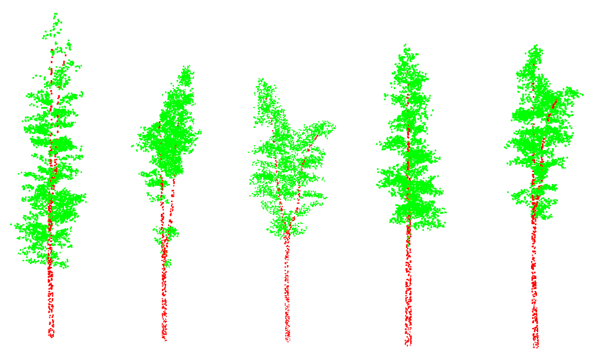
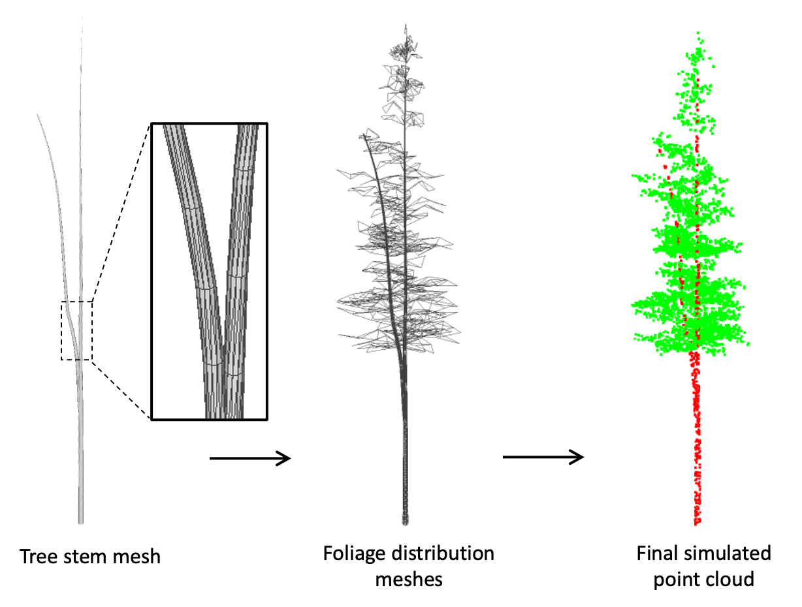

# Simple Synth Tree
A python-based simulation model for generating synthetic tree point clouds.

Source code associated with:

M. Bryson, F. Wang and J. Allworth, "Using synthetic tree data in deep learning-based individual tree segmentation using LiDAR point clouds", Remote Sens. 2023, 15(9), 2380; https://doi.org/10.3390/rs15092380
[https://www.mdpi.com/2072-4292/15/9/2380](https://www.mdpi.com/2072-4292/15/9/2380)

## About
"Simple Synth Tree" is a light-weight python library for generating simple synthetic point clouds of simulated trees. The simulation generates a randomised tree model composed of a central stem mesh and foliage/small branches, from which points are sampled from the surface of the mesh. Output point clouds are provided with per-point labels into one of two classes (class 0: foliage/small branches and class 1: tree stem).

Different tree structures can be generated by tuning the parameters of the model to control aspects such as tree height, canopy width and shape, branching etc. The simulator is designed to produce synthetic point clouds used to help train deep neural networks for LiDAR point cloud-based tree analysis tasks (see our Remote Sensing paper for more details and analysis of how using synthetic examples during training can be used to boost performance on real LiDAR point cloud processing tasks in forest remote sensing).

## Usage
see "generate_example_tree.py":

    points = gen_simtree(Np=4096)
    export_points_ply('example001.ply', points)
